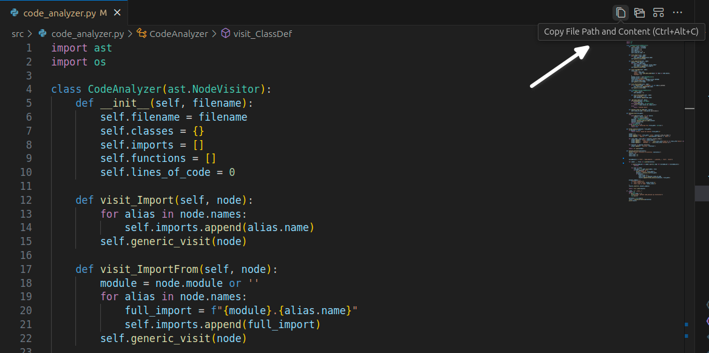
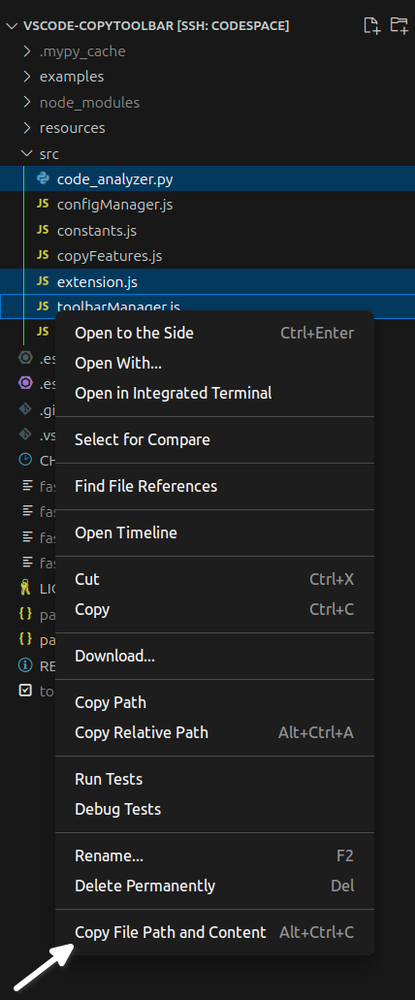

# FastPaste toolbar

**FastPaste** is the Visual Studio Code extension for developers who want to supercharge their productivity when working with AI tools like ChatGPT and Claude. It's not just about copying file paths or content—it's about providing AI with the precise context it needs to give you accurate, relevant, and actionable responses. Whether you're fixing bugs, adding features, or exploring code, FastPaste ensures you're not wasting time or money.

## Why FastPaste is Essential

When you're working on large production projects with complex codebases, providing your AI tools with the right context is crucial. Overly broad context questions to AI often result in generic suggestions that miss the mark, leading to frustration and wasted time. But by using **FastPaste**, you can quickly copy and paste relevant code snippets, entire modules, or project structures directly into your AI chat, making your interactions with tools like ChatGPT or Claude much more efficient.

### Key Benefits:

- **Enhanced AI Responses**: By providing the exact code context, you ensure that AI tools give you targeted, useful answers, improving your coding efficiency.
- **Cost Efficiency**: Use the chat-based version of AI tools, which is often cheaper and better optimized for large context handling compared to API-based solutions that charge per token.
- **Faster Workflow**: Quickly select and copy just the relevant parts of your project, paste them into your AI chat, and get accurate, actionable code changes without the need to sift through irrelevant information.

## Features

- **Instant Copy Commands**:
    - <svg width="16" height="16" viewBox="0 0 16 16" fill="currentColor" xmlns="http://www.w3.org/2000/svg"><path d="m4 4l1-1h5.414L14 6.586V14l-1 1H5l-1-1zm9 3l-3-3H5v10h8z"/><path d="M3 1L2 2v10l1 1V2h6.414l-1-1z"/></svg> **File Path & Content**: Copy the file path and content of the active file in one click.
    - <svg width="16" height="16" viewBox="0 0 16 16" fill="currentColor" xmlns="http://www.w3.org/2000/svg"><path d="M2 11h1V6.99H2zm1-5.01V5.5l.5-.5h4.43l.43.25.43.75h5.71l.5.5v8l-.5.5h-11l-.5-.5V12H1.5l-.5-.5v-9l.5-.5h4.42l.44.25.43.75h5.71l.5.5V6l-1-.03V4H6.5l-.43-.25L5.64 3H2v2.99zm5.07.76L7.64 6H4v3h3.15l.41-.74L8 8h6V7H8.5zM7.45 10H4v4h10V9H8.3l-.41.74z"/></svg> **Folder Content**: Copy all code files within a folder, respecting .gitignore rules, to provide comprehensive context to AI models. Copy entire module contents to provide AI models with the necessary context without sharing the entire codebase.
    - <svg width="16" height="16" viewBox="0 0 16 16" fill="currentColor" xmlns="http://www.w3.org/2000/svg"><path d="M2 2L1 3v3l1 1h12l1-1V3l-1-1zm0 1h12v3H2zm-1 7l1-1h3l1 1v3l-1 1H2l-1-1zm2 0H2v3h3v-3zm7 0l1-1h3l1 1v3l-1 1h-3l-1-1zm2 0h-1v3h3v-3z"/></svg> **Project Structure & Docs**: Generate and copy your project's structure using AST analysis, ensuring AI understands the full scope of your project.
- **Remote Explorer Compatibility**: Fully compatible with SSH-connected remote environments, making it effortless to copy and paste code, even when working on remote servers or virtual machines.
- **File Explorer Context Menu**: Select several files in File Explorer and use the `Copy File Path and Content` command to quickly share relevant code with AI tools.

### Toolbar screenshot



### Files explorer context menu



### Available Commands

You can access these commands through the command palette (`Ctrl+Shift+P`) or by using the associated toolbar buttons:

- `Copy File Path and Content`: Copies the file path and content of the current file.  
- `Copy Folder Content`: Copies the content of the folder containing the current file.  
- `Copy Project Structure and Docs`: Analyzes the project's structure and documentation and copies it.  

### Keybindings

The following keybindings are available by default:

- `Ctrl+Alt+C`: **Copy Current File Path and Content**
- `Ctrl+Alt+F`: **Copy Current Folder Path and Content**
- `Ctrl+Alt+S`: **Copy Project Structure and Docs**

## Installation

### Install via the Marketplace

1. Open Visual Studio Code.
2. Go to the Extensions view (`Ctrl+Shift+X`).
3. Search for "FastPaste".
4. Click **Install**.
5. Alternatively, you can install it directly via the following link: [FastPaste on VS Code Marketplace](https://marketplace.visualstudio.com/items?itemName=Aiomorphic.fastpaste).

### Install Manually from Source

1. Clone the repository:

```bash
git clone https://github.com/aiomorphic/vscode-fastpaste.git
cd vscode-fastpaste
```

2. Install the necessary dependencies:

```bash
npm install
```

3. Package the extension:

```bash
npx vsce package
```

4. Install the extension in Visual Studio Code:

- Open the Extensions view (Ctrl+Shift+X).
- Click on the three dots (...) in the top-right corner and select Install from VSIX....
- Browse to the .vsix file generated in the previous step and install it.

---

[](https://marketplace.visualstudio.com/items?itemName=Aiomorphic.fastpaste)
[](https://marketplace.visualstudio.com/items?itemName=Aiomorphic.fastpaste)
[](https://marketplace.visualstudio.com/items?itemName=Aiomorphic.fastpaste)

Happy coding with FastPaste! 🚀